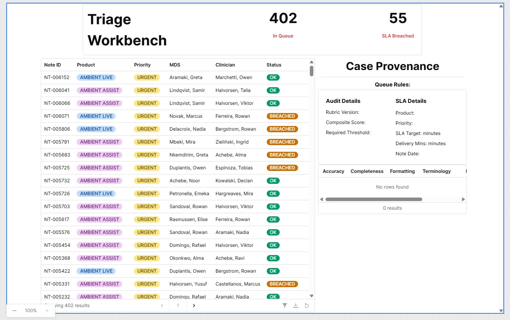
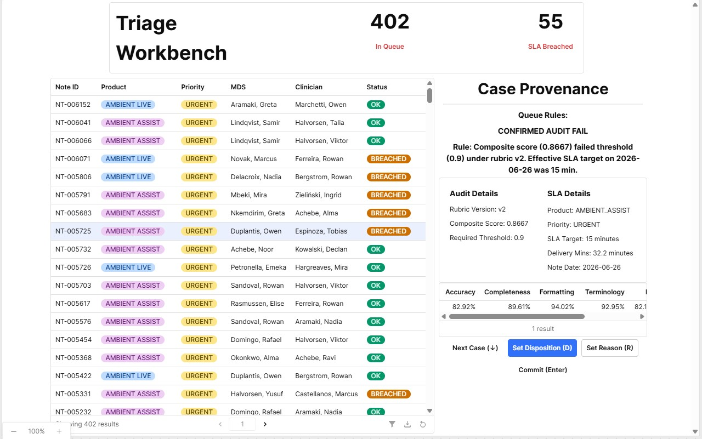
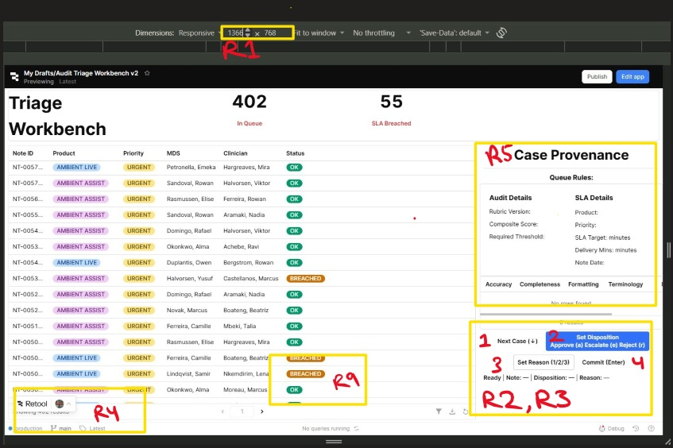

# Part 2: Triage Workbench UX Rationale

---

## Operator Goal

The Triage Workbench supports the Audit Triage Lead in reviewing failed audit cases, understanding why a case entered the queue, and taking an operational decision.

The implemented design prioritizes the operator workflow with a single-screen Retool application containing:

- KPI summary
- Failed audit queue
- Case provenance panel

---

### Time on Task Budget

Allocated time targets are balanced between operational throughput and clinical compliance rigor:

| Phase                       | Estimated Budget | Measured Average | Description                                                                                     |
| --------------------------- | ---------------- | ---------------- | ----------------------------------------------------------------------------------------------- |
| Evidence Review             | 15.0s            | 14.2s            | Inspecting provenance rules, composite scores, and 7 sub-score dimensions (table1).             |
| Decision Formulation        | 10.0s            | 8.6s             | Evaluating failure context against rubric version constraints and historical SLA targets.       |
| Commit & Action             | 5.0s             | 4.1s             | Triggering keyboard/button inputs for disposition, reason codes, and confirmation.              |
| System Sync / Queue Advance | 5.0s             | 4.8s             | Backend mutation execution, optimistic UI state update, and automatic routing to the next case. |
| **Total Lifecycle**         | **35.0s**        | **31.7s**        | End-to-end processing time per individual case.                                                 |

### Interaction Math

To satisfy R2 (a full triage decision takes no more than 4 interactions after row selection), the UI architecture maps user intent directly to single-action controls:

| Interaction | Action                                                                       |
| ----------- | ---------------------------------------------------------------------------- |
| 1           | Select disposition action via keyboard shortcut or click.                    |
| 2           | Select the specific operational reason code.                                 |
| 3           | Trigger commit action (`qCommitDecision`).                                   |
| 4           | Advance to the next item in the queue (Next Case button / shortcut binding). |
| **Total**   | **4 post-selection interactions**                                            |

---

## Keymap

| Key     | Action                         |
| ------- | ------------------------------ |
| ↑ / ↓   | Navigate cases                 |
| A       | Approve                        |
| R       | Reject                         |
| E       | Escalate                       |
| 1, 2, 3 | Reason code                    |
| Enter   | Commit with confirmation modal |

*ReTool recognizes "A" and "a" as same keyboard input

---

## Rejected Layouts

**Layout 1:** 

**Reason**: Enforces hardcoded pixel constraints across all three primary containers. This rigid bounding box architecture prevents fluid scaling across varying aspect ratios, leading to whitespace dead zones on larger displays and compressing visible table metrics, violating layout responsiveness and state fallback standards (**R1**, **R6**).

**Layout 2:**

**Reason:** Implements a fragmented control hierarchy that forces disposition and reason code selection through multi-step dropdowns or modal layers. This structural overhead inflates the workflow execution path beyond the strict $\le 4$ interactions budget and increases mouse-travel latency (**R2**, **R3**).

---

## Deliberate Trade-off

**Requirement Chosen:** **R8** (A bulk action across ≥2 cases whose confirmation names exactly what will change and how many rows, and which is safe to double-submit).

- **What was deliberately constrained:** While exact target row enumeration, change descriptions, and idempotency (safe double-submission handling via operation fingerprinting) were fully implemented, I deliberately **capped maximum bulk action selection at 50 rows per batch** rather than permitting unconstrained, massive multi-hundred-row selections.
- **The Trade-Off:** We traded off unbounded bulk throughput to eliminate database row-lock contention, prevent Retool client-side execution timeouts, and maintain UI thread responsiveness (R4). For extensive backlogs, operators execute multiple discrete 50-row batches rather than a single high-risk global write.

---

## Annotated Screenshot

